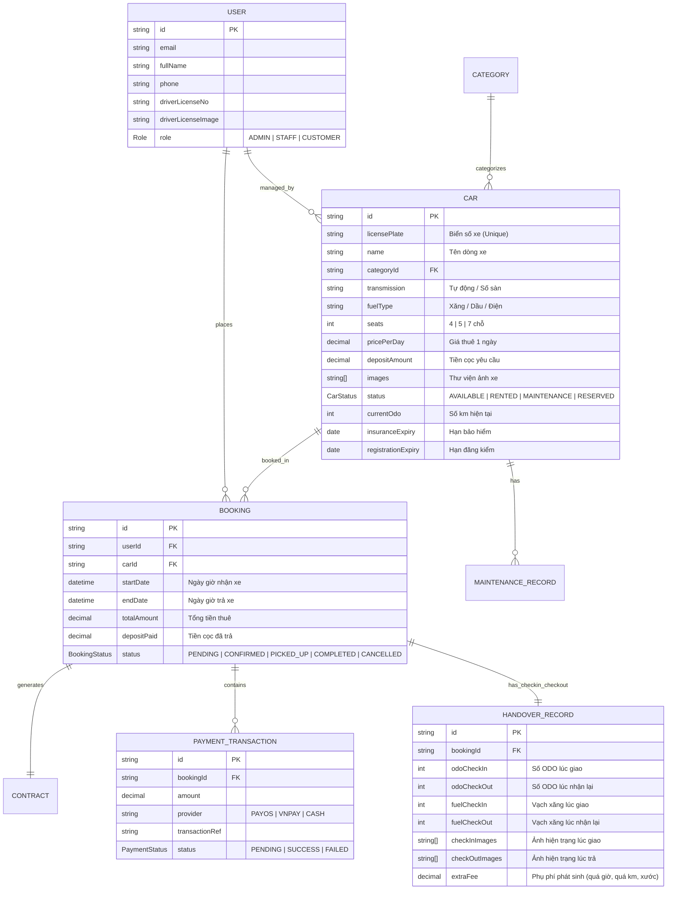

# Hệ Thống Quản Lý Cho Thuê Xe Tự Lái (Nhóm 04)

> **Dự án**: Nhom04_QuanLyThueXeTuLai  
> **Kiến trúc**: Client - Server Tách Biệt (Decoupled Full-Stack Architecture)

---
─────────┬────────────────────────────────────────────┘
                                            │ HTTPS / RESTful API (JSON) + JWT
┌───────────────────────────────────────────▼────────────────────────────────────────────┐
│                                BACK-END (NestJS API Server)                            │
│  • Core Framework: NestJS 11+ (Node.js + TypeScript), Modular Architecture              │
│  • ORM & Database: Prisma ORM, PostgreSQL (Relational Database)                        │
│  • Authentication & Security: JWT Access/Refresh Token, Passport.js, RBAC Guards, Helmet│
│  • Validation & Docs: class-validator, class-transformer, Swagger / OpenAPI            │
│  • Caching & Background Jobs: Redis, @nestjs/schedule (Cron), BullMQ (Queue)           │
│  • Storage & Media: Cloudinary SDK / AWS S3 (Lưu ảnh xe, ảnh GPLX/CCCD, biên bản giao)│
│  • Payment Gateway: PayOS / VietQR Open Banking API / VNPAY Sandbox                    │
│  • Mailer: Nodemailer / Resend (Gửi xác nhận đặt cọc, hóa đơn, nhắc hạn trả xe)        │
└────────────────────────────────────────────────────────────────────────────────────────┘
```

---

## 3. Cấu Trúc Thư Mục Dự Án (Project Structure)

### A. Front-end (`frontend/`)

```
frontend/
├── src/
│   ├── app/
│   │   ├── (auth)/                             # Login, Register, Forgot Password
│   │   │   ├── login/page.tsx
│   │   │   ├── register/page.tsx
│   │   │   └── layout.tsx
│   │   ├── (storefront)/                       # Cổng khách hàng (Public)
│   │   │   ├── layout.tsx
│   │   │   ├── page.tsx                        # Home: Search Widget, Xe Hot, Bảng giá
│   │   │   ├── cars/                           # Danh mục & Bộ lọc xe
│   │   │   │   ├── page.tsx
│   │   │   │   └── [slug]/page.tsx             # Chi tiết thông số, ảnh 360, chọn ngày thuê
│   │   │   ├── booking/                        # Luồng đặt xe (Multi-step)
│   │   │   │   └── page.tsx                    # Bước 1: Chọn ngày -> Bước 2: GPLX -> Bước 3: Cọc
│   │   │   ├── payment/                        # Kết quả thanh toán cọc (Success/Cancel)
│   │   │   │   └── callback/page.tsx
│   │   │   └── profile/                        # Lịch sử đơn thuê, hợp đồng của tôi
│   │   ├── (admin)/                            # Cổng quản trị Admin & Vận hành
│   │   │   ├── admin/layout.tsx
│   │   │   ├── admin/dashboard/page.tsx        # Thống kê doanh thu, tỷ lệ lấp đầy xe
│   │   │   ├── admin/cars/page.tsx             # CRUD Đội xe, bảo dưỡng, đăng kiểm
│   │   │   ├── admin/bookings/page.tsx         # Quản lý lịch đặt & Hợp đồng thuê xe
│   │   │   ├── admin/handover/page.tsx         # Biên bản bàn giao/trả xe (Check-in/Check-out)
│   │   │   └── admin/users/page.tsx            # Quản lý khách hàng, phân quyền nhân viên
│   │   ├── layout.tsx
│   │   └── not-found.tsx
│   ├── components/
│   │   ├── ui/                                 # Shadcn UI: button, dialog, table, badge, calendar,...
│   │   ├── common/                             # Header, Footer, DateRangePicker, CarCard, FileUpload
│   │   ├── storefront/                         # CarFilter, CarGallery, BookingSummary, PriceBreakdown
│   │   └── admin/                              # CarFormModal, BookingStatusBadge, HandoverChecklist
│   ├── hooks/                                  # useAuth, useCarFilter, useBooking, useDebounce
│   ├── lib/
│   │   ├── api/                                # Axios instance (interceptors, ApiError handler)
│   │   ├── seo/                                # createMetadata helper, JSON-LD generator
│   │   └── utils.ts                            # cn helper, formatCurrency, formatDate
│   ├── schemas/                                # Zod validation schemas (bookingSchema, carSchema)
│   ├── services/                               # car.service.ts, booking.service.ts, auth.service.ts
│   ├── stores/                                 # Zustand: useAuthStore, useBookingStore, useFilterStore
│   ├── styles/                                 # Sass: _variables.sass, _mixins.sass, globals.sass
│   └── types/                                  # Car, Booking, User, Contract, Payment types
```

### B. Back-end (`backend/` - NestJS)

```
backend/
├── src/
│   ├── common/                                 # Shared Guards, Interceptors, Filters, Decorators
│   │   ├── decorators/                         # @CurrentUser(), @Roles('ADMIN', 'STAFF', 'CUSTOMER')
│   │   ├── filters/                            # HttpExceptionFilter (Chuẩn hóa response lỗi)
│   │   ├── guards/                             # JwtAuthGuard, RolesGuard
│   │   └── interceptors/                       # TransformResponseInterceptor, LoggingInterceptor
│   ├── config/                                 # Configuration (database, jwt, payment, mailer, redis)
│   ├── modules/                                # Modular Feature Modules
│   │   ├── auth/                               # Đăng ký, đăng nhập, refresh token, hash password
│   │   ├── users/                              # Quản lý người dùng, phân quyền
│   │   ├── cars/                               # CRUD Xe, thông số, trạng thái xe, upload ảnh
│   │   ├── categories/                         # Hãng xe (VinFast, Toyota...), phân khúc (Sedan, SUV)
│   │   ├── bookings/                           # Đặt xe, tính toán tiền thuê, kiểm tra xe trùng lịch
│   │   ├── contracts/                          # Tạo hợp đồng thuê điện tử, xuất PDF
│   │   ├── handovers/                          # Biên bản bàn giao/nhận xe, chụp ảnh xước, đo ODO/xăng
│   │   ├── payments/                           # Tích hợp PayOS / VietQR / Webhook thanh toán cọc
│   │   ├── maintenance/                        # Lịch bảo dưỡng xe, cảnh báo đăng kiểm, bảo hiểm
│   │   ├── statistics/                         # Báo cáo doanh thu, tỷ lệ sử dụng xe theo tháng
│   │   └── notifications/                      # Gửi email xác nhận đặt cọc, nhắc trả xe
│   ├── prisma/                                 # Prisma Module & Service
│   │   ├── schema.prisma                       # Database Schema Models
│   │   └── migrations/                         # Migration history
│   ├── app.module.ts
│   └── main.ts                                 # Bootstrap NestJS: ValidationPipe, Swagger, CORS, Helmet
```

---

## 4. Sơ Đồ Cơ Sở Dữ Liệu (Database ERD - Prisma)



---
## 1. Tổng Quan & Bộ Công Nghệ (Tech Stack)

### A. Front-end (Client Portal & Admin Dashboard)
* **Core Framework**: Next.js 16 (App Router `src/app`), React 19, TypeScript 5 (Strict Mode).
* **UI & Design System**:
  * **Tailwind CSS v4** + Indented Sass (`.sass` / CSS Modules) cho design tokens & responsive mixins.
  * **Shadcn UI** & **Base UI React** (`@base-ui/react`): Bộ component headless chuẩn a11y.
  * **Lucide React**: Bộ icon vector.
  * **Swiper 14**: Xử lý Banner Slider, Showcase xe nổi bật & Gallery ảnh nội/ngoại thất.
* **Form & Data Management**:
  * **React Hook Form + Zod**: Validate dữ liệu đặt xe, thông tin GPLX/CCCD, form CRUD xe.
  * **TanStack Query v5 (React Query)**: Quản lý cache server state, phân trang, mutations.
  * **Zustand v5**: Quản lý client state (Bộ lọc xe, Giỏ booking draft, Auth store, Sidebar).
  * **Axios**: HTTP client với Interceptors (tự động đính kèm JWT Bearer token, chuẩn hóa lỗi tập trung `ApiError`).
* **Utilities & Media**:
  * `@tanstack/react-table`: Xử lý Data Table danh sách xe, hợp đồng, lịch đặt.
  * `date-fns`: Xử lý ngày giờ thuê, tính thời gian thuê, phụ phí quá hạn.
  * `react-dropzone`: Tải lên ảnh bằng lái xe GPLX/CCCD và ảnh hiện trạng xe.
  * `react-to-print` / `jspdf`: Xuất và in Hợp đồng điện tử & Biên bản bàn giao xe tại chỗ.
  * `sonner`: Toast thông báo trạng thái.
* **SEO & Security**:
  * Next.js Middleware: Phân quyền truy cập (RBAC), Content Security Policy (CSP).
  * SEO Engine (`createMetadata`): Tự động tạo thẻ OpenGraph, Twitter Card, JSON-LD Schema `CarRental` & `Product`.

### B. Back-end (NestJS API Server)
* **Core Framework**: NestJS 11+ (Node.js + TypeScript), Kiến trúc Modular (`modules/`).
* **Database & ORM**: **PostgreSQL** kết hợp **Prisma ORM** (Type-safe Schema & Migrations).
* **Authentication & Authorization**:
  * JWT Access Token / Refresh Token, Passport.js.
  * Role-based Access Control (`@Roles('ADMIN', 'STAFF', 'CUSTOMER')`).
* **Validation & API Documentation**:
  * `class-validator`, `class-transformer` với Global `ValidationPipe`.
  * **Swagger / OpenAPI** tự động tạo tài liệu API tại `/api/docs`.
* **Caching & Queue**:
  * **Redis**: Cache dữ liệu danh mục xe, rate limit.
  * `@nestjs/schedule` (Cron Job): Tự động hủy đơn chưa cọc quá hạn 30 phút, nhắc lịch bảo dưỡng xe, cảnh báo xe chưa trả.
* **Storage & Third-party Integrations**:
  * **Cloudinary SDK / AWS S3**: Lưu trữ ảnh xe, ảnh GPLX/CCCD của khách, ảnh biên bản bàn giao xe.
  * **Cổng Thanh Toán**: Tích hợp **PayOS / VietQR Open Banking API / VNPAY Sandbox** (Thanh toán cọc online & Webhook xác nhận tự động).
  * **Mailer**: **Nodemailer / Resend** (Gửi email hóa đơn, hợp đồng PDF, xác nhận đặt cọc thành công).

---

## 2. Sơ Đồ Kiến Trúc Hệ Thống

```
┌────────────────────────────────────────────────────────────────────────────────────────┐
│                               FRONT-END (Next.js 16 Client)                            │
│  • Framework: Next.js 16 (App Router), React 19, TypeScript 5 (Strict mode)            │
│  • UI & Styling: Tailwind CSS v4, Indented Sass (.sass), Shadcn UI, Base UI, Lucide   │
│  • Form & Validation: React Hook Form, Zod                                             │
│  • Table & Utilities: @tanstack/react-table, date-fns, react-dropzone, Sonner (Toast)  │
│  • Carousel & Media: Swiper 14, react-to-print (In hợp đồng & Biên bản bàn giao)       │
│  • State & Fetching: TanStack Query v5, Zustand v5, Axios (Interceptors, ApiError)    │
└──────────────────────────────────

## 5. Quy Trình Nghiệp Vụ Cốt Lõi

### Luồng 1: Khách hàng Đặt xe & Đặt cọc trực tuyến
1. **Tìm & Lọc xe**: Khách hàng chọn Ngày/Giờ nhận – trả xe và lọc theo dòng xe/hãng/giá.
2. **Kiểm tra tình trạng xe**: Front-end gửi request tới NestJS API (`/bookings/check-availability`) để đảm bảo xe chưa bị đặt trùng lịch.
3. **Khai báo thông tin**: Khách điền thông tin, upload ảnh 2 mặt Giấy phép lái xe (GPLX) qua Dropzone $\rightarrow$ lưu lên Cloudinary.
4. **Tạo đơn & Thanh toán cọc**:
   - NestJS khởi tạo đơn đặt xe (`PENDING`) và tạo mã thanh toán VietQR / PayOS.
   - Khách quét mã thanh toán $\rightarrow$ Webhook PayOS phản hồi về NestJS $\rightarrow$ Đổi trạng thái đơn sang `CONFIRMED`, đổi trạng thái xe sang `RESERVED`.
5. **Thông báo**: Hệ thống tự động gửi Email xác nhận đặt xe thành công kèm hợp đồng tóm tắt.

### Luồng 2: Quy trình Bàn giao xe (Pick-up) & Trả xe (Return)
1. **Bàn giao xe (Check-in)**:
   - Nhân viên kiểm tra và đối chiếu bản gốc GPLX/CCCD của khách.
   - Ghi nhận số ODO, vạch pin/xăng và chụp ảnh 4 góc xe (ghi nhận vết trầy xước có sẵn).
   - In hợp đồng thuê xe điện tử (`react-to-print`), hai bên ký kết $\rightarrow$ Xe chuyển sang trạng thái `RENTED`.
2. **Nhận lại xe (Check-out)**:
   - Nhân viên kiểm tra số ODO thực tế (tính phí vượt km nếu có), mức xăng/pin hoàn trả, kiểm tra xước sát mới.
   - Hệ thống tự động tính toán tổng quyết toán và số tiền cọc hoàn trả $\rightarrow$ Đóng hợp đồng, xe chuyển về trạng thái `AVAILABLE` (hoặc `MAINTENANCE` nếu cần vệ sinh/sửa chữa).

---

## 6. Lộ Trình Triển Khai (6 Phases Roadmap)

| Giai đoạn | Hạng mục Front-end (Next.js 16) | Hạng mục Back-end (NestJS) |
| :--- | :--- | :--- |
| **Phase 1: Khởi tạo Project & Base Infrastructure** | • Cài đặt Next.js 16, TS 5, Tailwind v4, Sass.<br>• Tích hợp Shadcn UI, Sonner, React Hook Form, Zod.<br>• Cấu hình Axios Interceptors & TanStack Query. | • Setup NestJS project, cấu hình TypeScript, ConfigModule.<br>• Setup PostgreSQL, kết nối Prisma ORM & Migration initial schema.<br>• Swagger OpenAPI & Global Exception Filter. |
| **Phase 2: Auth & Fleet Management (Quản lý đội xe)** | • Màn hình Login/Register (Khách & Admin).<br>• Trang Admin Quản lý Xe: Data Table (`@tanstack/react-table`), Form thêm/sửa xe, upload ảnh xe. | • Auth Module (JWT, Refresh Token, Role Guard: Admin/Staff/Customer).<br>• Cars Module: CRUD Xe, lọc xe theo tiêu chí, upload ảnh lên Cloudinary. |
| **Phase 3: Storefront & Car Catalog (Trang Khách hàng)** | • Trang chủ: Hero Swiper Banner, Quick Search Widget (DateRangePicker).<br>• Trang Danh sách xe (`/cars`): Dynamic Filter, Sort.<br>• Trang Chi tiết xe (`/cars/[slug]`): Gallery ảnh, thông số kỹ thuật, bảng giá. | • Public Cars API (Phân trang, tìm kiếm full-text, lọc theo ngày xe trống).<br>• Categories & Attributes API. |
| **Phase 4: Booking Flow & Cổng Thanh Toán** | • Multi-step Booking Form: Chọn lịch $\rightarrow$ Upload GPLX $\rightarrow$ Chọn phụ kiện $\rightarrow$ Quét mã QR cọc.<br>• Trang kết quả thanh toán & Lịch sử đơn thuê (`/profile`). | • Bookings Module: Validate trùng lịch, tính tổng tiền thuê & cọc.<br>• Payments Module: Tích hợp PayOS/VietQR API & Webhook xử lý cọc tự động.<br>• Mailer Module (Nodemailer gửi email hóa đơn/xác nhận). |
| **Phase 5: Vận hành, Hợp đồng & Bàn giao xe (Operations)** | • Trang Quản lý Hợp đồng & Lịch đặt xe.<br>• Màn hình Bàn giao xe Check-in/Check-out (Upload ảnh hiện trạng, tính phụ phí, in hợp đồng).<br>• Dashboard thống kê doanh thu & tỷ lệ khai thác xe. | • Contracts & Handover Module: Lưu biên bản giao xe, tính tiền phát sinh.<br>• Statistics Module: Query tổng hợp doanh thu, biểu đồ tỷ lệ xe hoạt động.<br>• Cron Jobs: Tự hủy đơn quá hạn cọc, cảnh báo bảo dưỡng xe. |
| **Phase 6: Tối ưu SEO, Security & Deployment** | • SEO Engine: `createMetadata`, JSON-LD schema `CarRental`.<br>• Responsive testing (Mobile/Tablet/Desktop), CSP Middleware. | • Helmet, Rate Limiting (Throttler), Redis Caching.<br>• Dockerize cả Frontend & Backend, chuẩn bị CI/CD. |

- Kiểm tra và đồng bộ giao diện Frontend